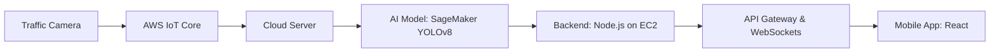

# Design Specification: GLOSA-BHARAT

## 1. Architecture Overview
GLOSA Bharat follows a cloud-native architecture optimized for **AWS**, designed to handle real-time traffic telemetry with high availability.

1. **Data Ingestion Layer**: Captures real-time vehicle data from existing traffic cameras and transmits it via **AWS IoT Core**.
2. **AI Processing Layer (Amazon SageMaker)**: Executes YOLOv8-based vehicle detection to analyze congestion and signal timing in real-time.
3. **Backend Layer (Amazon EC2)**: Processes predictions and calculates optimal speeds using Node.js logic.
4. **User Interface (AWS Amplify)**: Delivers live speed recommendations and signal countdowns to the mobile app (React).

## 2. Component Design

### 2.1 AI Processing (Amazon SageMaker)
- **Model:** YOLOv8 optimized for high-density traffic.
- **Function:** Predicts the ideal speed based on congestion patterns and signal timing analysis.

### 2.2 Backend & Communication (Amazon EC2 + API Gateway)
- **Runtime:** Node.js with **@aws-sdk** integration.
- **AWS IoT Implementation:** The backend includes a dedicated utility (`aws-service.js`) that publishes junction telemetry to **AWS IoT Core**.
- **SageMaker Integration:** Implements the **InvokeEndpointCommand** to source real-time predictions from scalable Amazon SageMaker endpoints.

### 2.3 User Interface (AWS Amplify)
- **Platform:** React-based mobile application.
- **Features:** Displays live "Green Wave" speed advice and signal countdowns.

## 3. Data Flow & Sequence (Process Flow)

## 4. Security & Sustainability
- **Data Sovereignty:** All processing occurs on local/territorial cloud instances Aligned with Atmanirbhar Bharat.
- **Resilience:** If AI service fails, the Coordination layer falls back to historical density models.

---
*Generated using Kiro Design Phase Pipeline.*
